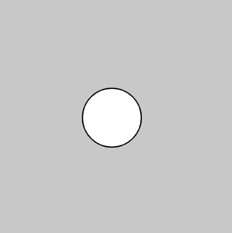
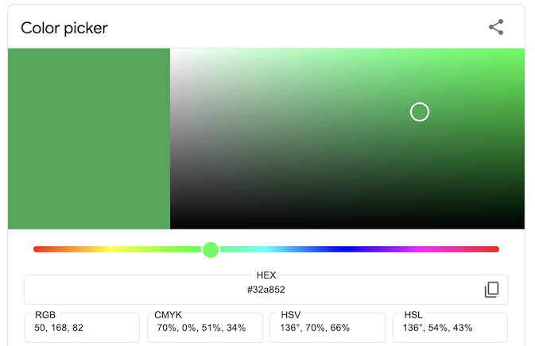
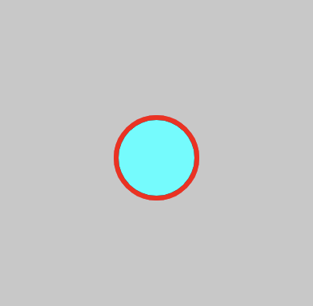
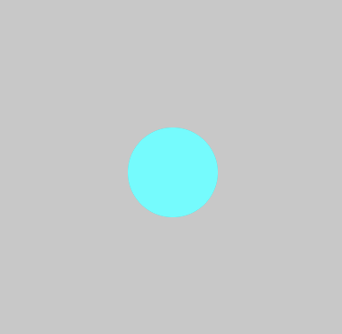

# 1. Drawing with p5.js

  - [Shapes](#shapes)
  - [Color](#color)
    - [fill() & stroke()](#fill--stroke)
  - [Resources](#other-resources)

---

## Shapes
[p5.js](https://p5js.org/reference/) is an easy-to-learn Javascript library designed to make drawing, animations, games, interactive art, and more!

We will be editing the **script.js** file. Each script file will have a `setup()` (run one time) and a `draw()` (code that is run continuously as long as the programming is running). Let's start by drawing an ellipse to the screen:

```javascript
function setup() {
  createCanvas(400, 400);
}

function draw() {
  background(200);

  // x, y, diameter
  ellipse(100, 100, 50);
}
```


`ellipse()` takes 3 arguments, or numbers, inside the parenthesis. These represent x, y, and diameter (if you give it a fourth argument you will specify the width and height of the ellipse). 

```javascript
// x, y, w, h
ellipse(100, 100, 50, 30);
```


You can read more about the ellipse function [here](https://p5js.org/reference/#/p5/ellipse). Check out the [p5.js reference](https://p5js.org/reference/) for information about drawing other shapes such as: 
* `rect()` 
* `line()`
* `triangle()`

## Color
Color in digital spaces can be defined by combining a red, green, and blue values (a RGB color space). In p5.js, we specify values in the range 0-255.

For example, to make the background **red**:

```javascript
background(255, 0, 0);
```

Or **blue**:
```javascript
background(0, 0, 255);
```

Check out **[this color picker](https://g.co/kgs/SN5wSS)** to find the RGB values of any color.



### fill() & stroke()
To specify the color of a shape, we call `fill()` before the shape. `stroke()` sets the outline color and `strokeWeight()` sets the width of the outline:

```javascript
function draw() {
  background(200);

  strokeWeight(3);
  stroke(255, 0, 0);
  fill(0, 255, 255);
  ellipse(100, 100, 50);
}
```



Likewise, to remove fill or stroke we use `noFill()` and `noStroke()`

```javascript
function draw() {
  background(200);

  // removing stroke
  noStroke();

  fill(0, 255, 255);
  ellipse(100, 100, 50);
}
```




## Resources
* [p5.js reference page](https://p5js.org/reference/)
* [1.3: Shapes & Drawing](https://www.youtube.com/watch?v=c3TeLi6Ns1E&list=PLRqwX-V7Uu6Zy51Q-x9tMWIv9cueOFTFA&index=5) (Daniel Shiffman)
* [1.4: Color](https://www.youtube.com/watch?v=riiJTF5-N7c&list=PLRqwX-V7Uu6Zy51Q-x9tMWIv9cueOFTFA&index=6) (Daniel Shiffman)
