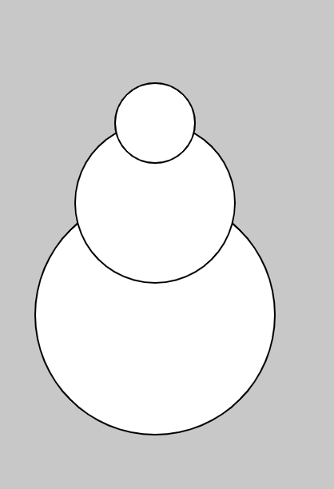
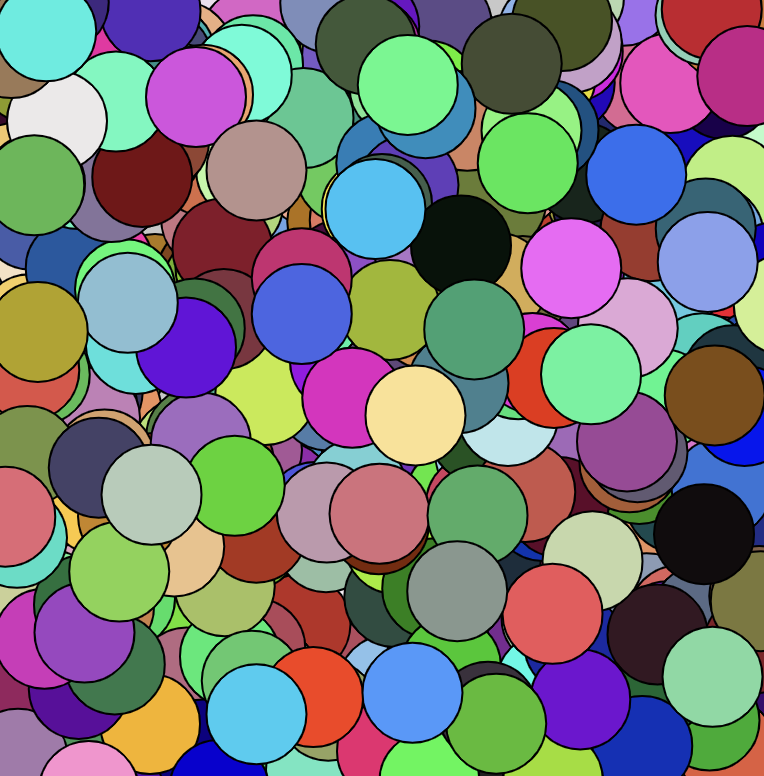
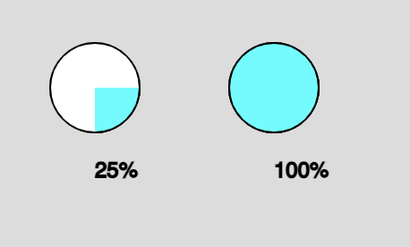

# 3. Functions

  - [Abstraction (why functions?)](#abstraction-why-functions)
  - [Declaring & Calling functions](#declaring--calling-functions)
  - [Function Arguments & Parameters](#function-arguments--parameters)
  - [Returning Values](#returning-values)
    - [random()](#random)
    - [map()](#map)
    - [other predefined return functions](#other-predefined-return-functions)
    - [define functions that return values](#define-functions-that-return-values)
  - [Resources](#resources)

---

## Abstraction (why functions?)
A **function** is a block of code that performs a task or calculates a value. This block of code is referred to by a name (e.g. background()). Functions are important in computer science for:

**Abstraction** in computer science is the process of organizing complex code into discrete, simple units. Writing functions is one example of abstraction at play: by grouping lines of code under the heading of a function name, we reduce the complexity of our program and make it easier to understand.

Take a look at the `snowman()` function. By giving a name to 3 ellipses, we make our code easier to understand by abstracting away extraneous information.


```javascript
function setup() {
    createCanvas(400, 400);
}

function draw() {
    background(200);
    snowman();
}

function snowman() {
    ellipse(100, 200, 150);
    ellipse(100, 130, 100);
    ellipse(100, 80, 50);
}
```


## Declaring & Calling functions
So far we have seen many functions, such as:
* `rect()`
* `ellipse()`
* `background()`
* `stroke()`
* `setup()`
* `draw()`

To create our own functions, we must first **declare** them (outside of the `setup()` or `draw()`):
```javascript
function helloWorld() {
    console.log("my first function");
}
```
If you run this code, however, nothing is printed to the console. That is because we need to **call** our function inside the `setup()` or `draw()` (these two functions are unique in that p5.js calls them automatically).

```javascript
function setup() {
     // function call
    helloWorld();
}

// function declaration
function helloWorld() {
    console.log("my first function");
}
```

## Function Arguments & Parameters
Function **arguments** are the values we pass inside the parentheses. In the example below, the numbers inside `ellipse()` (representing x, y, and diameter) are arguments:

```javascript
ellipse(100, 100, 30);
ellipse(50, 100, 30);
```

We can write our own functions with arguments. Consider the following example that spawns a popup stating, "Hello, [insert name]".

```javascript
function setup() {
    // call function with string arguments
    sayHello("Jenna");
    sayHello("Jamie");
}

// function declaration
function sayHello(name) {
    alert("Hello, " + name);
}
```

`sayHello()` has a **parameter**, *name*. Function parameters are the variable placeholders in the function definition (e.g. name). Function arguments are the real values passed to (and received by) the function (e.g. "Jenna").  

It's possible to pass multiple arguments to a function. We do this by separating the values with parentheses:

```javascript
function setup() {
  sayHello("Jenna", "deBoisblanc");
  sayHello("Jamie", "Kellogg"); 
}

function sayHello(firstName, lastName) {
  alert("Hello, " + firstName + " " + lastName);
}
```


## Returning Values
While some functions merely complete a task, display a value, or print to the console, other functions can perform a calculation and **return** a value. 

### random()
There are certain *predefined* functions within p5.js that return values. When called, `random()` will return a floating-point number (a number with a decimal).

```javascript
let a = random();       // returns a number from 0 (inclusive) to 1 (exclusive)
let b = random(10);     // returns a number from 0 (inclusive) to 10 (exclusive)
let c = random(2, 4);   // returns a number from 2 (inclusive) to 4 (exclusive)
```

Let's use `random()` in an example to randomly draw random colored ellipses all over the canvas:

```javascript
function setup() {
    createCanvas(400, 400);
    background(200);
}

function draw() {
    // set x and y to a random location on the canvas
    let x = random(width);
    let y = random(height);

    // randomized red, green, and blue values
    fill(random(255), random(255), random(255));
    ellipse(x, y, 50);
}
```



### map()
`map()` is another pre-defined p5.js function that returns a value. `map()` is a useful function allows us to take an input range and *maps* it to an output range. 

```javascript
map(value, start1, stop1, start2, stop2);
```

Let's see an example to make sense of what `map()` accomplishes. Let's say we want to program a `pieChart()` function that takes a percentage (represented as a decimal from 0-1) and displays a piechart.

In the piechart example, `map()` maps an input range (0-1) and converts the percent to an output range: radians of an arc (0-2PI). 

```javascript
// value, start1, stop1, start2, end2
let rad = map(percent, 0, 1, 0, 2*PI);
```

We will also need:
* `arc()` (parameters x, y, w, h, starting radians, ending radians)
* `round()` (another predefined p5.js function that returns a rounded number)

```javascript
function setup() {
  createCanvas(400, 400);
}

function draw() {
  background(220);
  
  pieChart(100, 100, 50, .25);
  pieChart(200, 100, 50, 1);
}

function pieChart(x, y, diameter, percent) {
  fill(255);
  ellipse(x, y, diameter);
  
  stroke(0);
  fill(0, 255, 255);
  
  // map percent (0-1) to radians (0 - 2PI)
  let rad = map(percent, 0, 1, 0, 2*PI);
  arc(x, y, diameter, diameter, 0, rad);
  
  fill(0);
  // round() returns a rounded value
  let percentText = round(percent*100) + "%";
  text(percentText, x, y + diameter);
}
```


### Other predefined return functions
Check the [p5.js reference](https://p5js.org/reference/) to familiarize yourself with some other functions that return values:
* `mills()` (number of milliseconds passed since program began)
* `pow()` (exponent)
* `sqrt()` 
* `dist()` (distance between two points)
* `sin()`, `cos()` and other trig functions
* `constrain()`, `ceil()`, `floor()`, `round()` (to limit values)

Color functions such as:
* `lerpColor()` (interpolate between 2 colors)
* `color()` (returns a color object)

Other functions defined by JavaScript that return values:
* `prompt()` (gets user input)
* `parseInt()` (converts a string to an integer)
* `parseFloat()` (converts a string to a decimal number)


### Define functions that return values
We can use the keyword `return` to specify that functions should store a value in memory after they are called. 

```javascript
function getCircumference(radius) {
    return 2*PI*radius;
}
```

We can subsequently store the value returned by the `getCircumference()` function in a variable:

```javascript
function setup() {
    let c = getCircumference(10);
    console.log(c);
}

function getCircumference(radius) {
    return 2*PI*radius;
}
```

As a perhaps more exciting example, let's say we want to write a function, `getTempColor()` that converts temperature in Celsius (in a range from 0 to 40 degrees C) to a color on a gradient scale from blue to red. Examine all of the functions in the example below that return values: 


```javascript
function setup() {
    createCanvas(400, 400);

    let celsiusString = prompt("Please enter temperature in celsius");
    let celsius = parseFloat(celsiusString); // turn the string to a float
    background(getColorFromTemp(celsius));
}

function getColorFromTemp(celsius) {
    // constrain the temperature to the range 0-40
    celsius = constrain(celsius, 0, 40);
    // map the temperature range to a number from 0-1
    let percent = map(celsius, 0, 40, 0, 1);
    // define red and blue colors
    let r = color(255, 0, 0);
    let b = color(0, 0, 255);
    // use lerpColor() to return a color interpolated between red and blue
    return lerpColor(b, r, percent);
}
```

## Resources
* [2.4: random() Function](https://www.youtube.com/watch?v=POn4cZ0jL-o&list=PLRqwX-V7Uu6Zy51Q-x9tMWIv9cueOFTFA&index=11) (Daniel Shiffman)
* [2.5: The map() Function](https://www.youtube.com/watch?v=nicMAoW6u1g&list=PLRqwX-V7Uu6Zy51Q-x9tMWIv9cueOFTFA&index=12) (Daniel Shiffman)