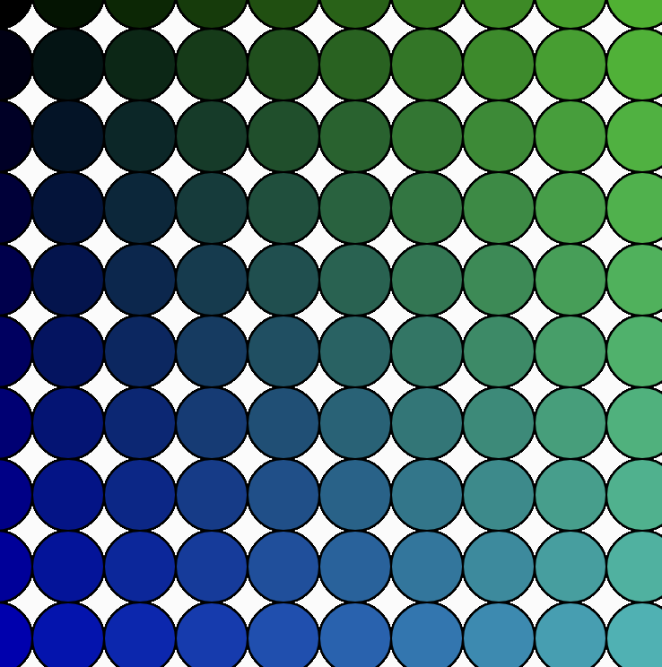

# 5. Loops

  - [for loop](#for-loop)
  - [while](#while)
  - [nested loops](#nested-loops)
  - [Resources](#resources)
---

## for loop
A for loop is a control structure that allows us to iteratively repeat code. In the code snippet below we:

1. initialize a variable `let x = 0`
2. check the condition each time the loop is repeated (is x < 20 ?)
3. each time the loop is over, increment the variable (x++)

```javascript
// prints 0, 1, ... 19
for (let i = 0; i < 20; i++) {
  console.log(i);
}
```

We can increment i by any amount:
```javascript
// prints 0, 2, 4, ... 18
for (let i = 0; i < 20; i += 2) {
  console.log(i);
}
```

Let's say we want to draw 10 ellipses, but we want to reduce the number of lines of code. We can use a for loop in the following manner:

```javascript
function setup() {
  createCanvas(400, 400);
}

function draw() {
  fill(0, 255, 0);
  for (var x = 0; x < 10; x++) {
     ellipse(x*40, width/2, 40);
  }
}
```


## while
A while loop is another structure to repeat code. Unlike a for loop, however, while loops repeat as long as a condition is true:

```javascript
while(/* condition */) {
    // repeat condition while condition is true
}
```

We can use while to draw 10 ellipses like we did with a for loop:

```javascript
function setup() {
  createCanvas(400, 400);
}

function draw() {
    fill(0, 255, 0);
    let i = 0;
    while (i < 10) {
        ellipse(i * 40, width / 2, 40);
        i++;
    }
}
```

## nested loops
It's possible to use loops inside of loops. Let's create 10 rows (by incrementing variable i) and 10 columns (by incrementing variable j) of ellipses. We'll change the RGB by x and y.

```javascript
function setup() {
  createCanvas(400, 400);
}

function draw() {
  for (let x = 0; x < 10; x++) {
     for (let y = 0; y < 10; y++) {
        fill(0, x*20, y*20);
        ellipse(x*40, y*40, 40, 40);
     }
  }
}
```




## Resources
* [4.1: while and for Loops](https://www.youtube.com/watch?v=cnRD9o6odjk&list=PLRqwX-V7Uu6Zy51Q-x9tMWIv9cueOFTFA&index=18) (Daniel Shiffman)
* [4.2: Nested Loops](https://www.youtube.com/watch?v=1c1_TMdf8b8&list=PLRqwX-V7Uu6Zy51Q-x9tMWIv9cueOFTFA&index=19) (Daniel Shiffman)