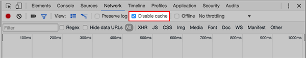

# Running Projects Locally

### Install
* Make sure you have [Visual Studio Code](https://code.visualstudio.com/) (or some other code text editor of your choice)
* Instal [Node.js](https://nodejs.org/en/)

### Project Files
* Create a folder with all of your project files (`sketch.js`, `index.html`, etc.) inside of that folder.

### Terminal
* Open a terminal window and change into the directory where your project is. For example, to get into a Project 1 folder on the Desktop:

```shell
cd ~/Desktop/Project\ 1
```

* type the following command into your terminal:

```shell
npx http-server
```

* Open a web browser and go to `localhost:8080` or whatever URL is posted in your terminal.

### Developer Window (to see changes)
In order to see your changes when you save / refresh, you need to:
* Have your developer window always open
  * Menu > More Tools > Developer Tools
  * For shortcuts use Cmd + Opt + I on a Mac or F12 on Windows.
* **disable the cache** 
  * Network tab of developer tools, click to disable cache

