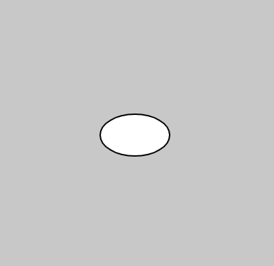
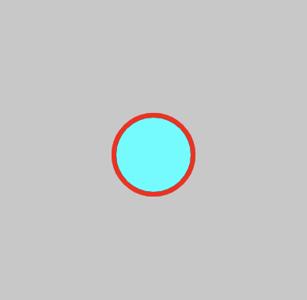
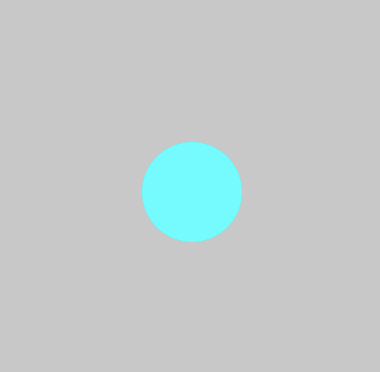

# 0. Getting Started

  - [Repl.it](#replit)
  - [console.log()](#consolelog)
  - [comments](#comments)
  - [Drawing with p5.js](#drawing-with-p5js)
    - [Shapes](#shapes)
    - [Color](#color)
    - [fill() & stroke()](#fill--stroke)
  - [Resources](#resources)
---

## Repl.it
Repl.it will be the platform we use to do assignments, collaborate on projects, and much more! Open the pane on the left-hand side to see project files:  

1. **instructions.md**: I will put **assignment instructions** *in markdown*, so start each assignment by checking the **instructions.md** page (under files on the left-side. panel).   
Note: this file (like *instructions.md*) is a **markdown** file (.md file extension). Markdown has its own syntax and is used by programmers to create text-based instructions, tutorials, and other notes. If you're curious about it, read more [here](https://www.markdownguide.org/basic-syntax/)!

2. **script.js**: where we will write code (JavaScript)

3. **index.html**: an HTML file that loads our script and libraries (p5.js). We will talk more about HTML at a later date.


## console.log()

Sometimes we will want to print values as our code runs (primarily for debugging our program). Add the following code to the script.js and see the output in the "Console" tab.

```javascript
console.log("Hello World");
```

"Hello World" is a string (text). We can also print numbers, mathematical expressions, and more.


```javascript
console.log(2.5);
console.log(3 + 6 / 2);
```

## comments
Comments in programming are a way to document our code and leave human-readable notes for other programmers. It is good practice to frequently use comments.

```javascript
// single line comment for humans!
console.log("for computers");

/*
    Multi-line comment
    
    Great for code headers (name, date, source, etc.), 
    explaining functions,...
*/
```

## Drawing with p5.js

  - [Shapes](#shapes)
  - [Color](#color)
    - [fill() & stroke()](#fill--stroke)
  - [Resources](#other-resources)

---

### Shapes
[p5.js](https://p5js.org/reference/) is an easy-to-learn Javascript library designed to make drawing, animations, games, interactive art, and more!

We will be editing the **script.js** file. Each script file will have a `setup()` (run one time) and a `draw()` (code that is run continuously as long as the programming is running). Let's start by drawing an ellipse to the screen:

```javascript
function setup() {
  createCanvas(400, 400);
}

function draw() {
  background(200);

  // x, y, diameter
  ellipse(100, 100, 50);
}
```


`ellipse()` takes 3 arguments, or numbers, inside the parenthesis. These represent x, y, and diameter (if you give it a fourth argument you will specify the width and height of the ellipse). 

```javascript
// x, y, w, h
ellipse(100, 100, 50, 30);
```



You can read more about the ellipse function [here](https://p5js.org/reference/#/p5/ellipse). Check out the [p5.js reference](https://p5js.org/reference/) for information about drawing other shapes such as: 
* `rect()` 
* `line()`
* `triangle()`

### Color
Color in digital spaces can be defined by combining a red, green, and blue values (a RGB color space). In p5.js, we specify values in the range 0-255.

For example, to make the background **red**:

```javascript
background(255, 0, 0);
```

Or **blue**:
```javascript
background(0, 0, 255);
```

Check out **[this color picker](https://g.co/kgs/SN5wSS)** to find the RGB values of any color.


### fill() & stroke()
To specify the color of a shape, we call `fill()` before the shape. `stroke()` sets the outline color and `strokeWeight()` sets the width of the outline:

```javascript
function draw() {
  background(200);

  strokeWeight(3);
  stroke(255, 0, 0);
  fill(0, 255, 255);
  ellipse(100, 100, 50);
}
```



Likewise, to remove fill or stroke we use `noFill()` and `noStroke()`

```javascript
function draw() {
  background(200);

  // removing stroke
  noStroke();

  fill(0, 255, 255);
  ellipse(100, 100, 50);
}
```




## Resources
* [p5.js reference page](https://p5js.org/reference/)
* [(Daniel Shiffman) 1.3: Shapes & Drawing](https://www.youtube.com/watch?v=c3TeLi6Ns1E&list=PLRqwX-V7Uu6Zy51Q-x9tMWIv9cueOFTFA&index=5) 
* [(Daniel Shiffman) 1.4: Color](https://www.youtube.com/watch?v=riiJTF5-N7c&list=PLRqwX-V7Uu6Zy51Q-x9tMWIv9cueOFTFA&index=6) 
