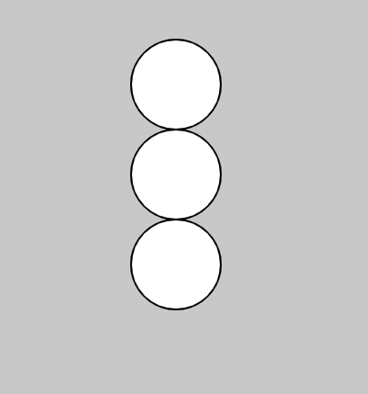

# 2. Variables

**Variables** in computer science are named entities that serve as placeholders for stored values. Variables can store all sorts of things: numbers, words, and more!

  - [Data Types](#data-types)
  - [Declaring Variables](#declaring-variables)
  - [Initializing Variables](#initializing-variables)
  - [Built-in Variables](#built-in-variables)
  - [Variable Scope](#variable-scope)
    - [global scope](#global-scope)
    - [function scope (local)](#function-scope-local)
    - [block scope](#block-scope)
  - [Mathematical Operators](#mathematical-operators)
    - [Arithmetic Operators](#arithmetic-operators)
    - [Assignment Operators](#assignment-operators)
    - [String Concatenation](#string-concatenation)
  - [Resources](#resources)
---

## Data Types
Data types describe the type of data that we are storing in a variable. In JavaScript, there are seven types:

1. **Number**: integers, numbers with decimals (2, 4.35, -202, ...)
2. **String**: text surrounded by single or double quotes ("Hello World" or 'Hello World!')
3. **Boolean**: true or false
4. **Null**: the *intentional* absence of a value
5. **Undefined**: when variables lack a value

Don't worry about the following data types for now: **Symbol**, **Object**

## Declaring Variables
There are three ways to *declare* variables in JavaScript. 
1. `let`
2. `const` (ensures variable can't change)
3. `var` 
   
For now, we will focus on `let`. We can *declare* (and *initialize*) variables at the top of our sketch:

```javascript
// declaring & initializing x and y at the top of our sketch
let x = 100;
let y = 50;

function setup() {
  createCanvas(400, 400);
}

function draw() {
  background(200);
  ellipse(x, y, 50);
}
```

Notice how we can use arithmetic expressions with variables:

```javascript
let x = 100;
let y = 50;

function setup() {
  createCanvas(400, 400);
}

function draw() {
  background(200);
  
  ellipse(x, y, 50);
  ellipse(x, y + 50, 50);
  ellipse(x, y + 100, 50);
}
```


**Key Reflection Question:** why use variables??

## Initializing Variables
We don't always have to *initialize* the variable immediately when we declare it (unless we used `const`). Variables that store colors (colors are technically the "object" data type), for example, must be initialized in the `setup()` or `draw()`. For example:

```javascript
// declaring color variables
let tealColor, orangeColor;

function setup() {
  createCanvas(400, 400);

  // initializing color variables
  tealColor = color(0, 255, 255);
  orangeColor = color(255, 220, 100);
}

function draw() {
  background(tealColor);
  fill(orangeColor);
  rect(100, 100, 100);
}
```


**If we don't initialize variables...**

* `undefined` will be its value
* `NaN` (not a number) if we try to compute a value with it
* throw an error in the console if we try to pass it to a function like `rect()`

```javascript
let x;

function setup() {
  createCanvas(400, 400);
  
  console.log(x);       // undefined
  console.log(x + 2);   // NaN
  rect(x, 10, 10, 10);  // throws an error
}
```

## Built-in Variables
p5.js has a few **built-in variables** that are already defined and ready to use:

* `width` - the width of the canvas  
* `height` - the height of the canvas  

* `windowWidth` - the width of the *window* containing the canvas  
* `windowHeight` - the height of the *window* containing the canvas  
  
* `mouseX` - the mouse's x-coordinate    
* `mouseY` - the mouse's y-coordinate

We usually only use `windowWidth` and `windowHeight` in the `setup()` to make the canvas fullscreen:

```javascript
function setup() {
  createCanvas(windowWidth, windowHeight);
}
```

`width` and `height` come in handy when we want to write programs that respond to the canvas size. For example, to perfectly center an ellipse:

```javascript
function setup() {
  createCanvas(windowWidth, windowHeight);
}

function draw() {
    background(0, 100, 100);
    ellipse(width/2, height/2, 50);
}
```


We can create a paintbrush using `mouseX` and `mouseY`. Make note of the `background()`'s second argument. Colors in p5.js can be provided an alpha value (transparency). See the [color reference](https://p5js.org/reference/#/p5/color).

```javascript
function setup() {
  createCanvas(windowWidth, windowHeight);
}

function draw() {
  background(0, 5);
  ellipse(mouseX, mouseY, 50);
}
```


## Variable Scope
Variable **scope** refers to the set of variables, objects, and functions that we can access from a particular location in the code. There are three scopes in JavaScript:
1. global
2. function
3. block

### global scope
So far we have declared **global** variables. Global scope means the variable can be accessed (and changed) anywhere in the code.

```javascript
let a = 10;             // global variable

function setup() {
  console.log(a);       // 10
  a = 5;
}

function draw() {
  console.log(a);       // 5
}
```


In general, it is best programming practice to **avoid global variables**. Global variables may lead to naming conflicts (in big programs) or situations where we accidentally mutate (change) data in unexpected ways.

### function scope (local)
```javascript
function setup() {
  let a = 5;        // local variable
  console.log(a);
}

function draw() {
  console.log(a);   // throws an error (a is not defined)
}
```

**If you forget to declare** the variable with `let`, `var`, or `const`, it will be *hoisted* to a global scope:

```javascript
function setup() {
  a = 5;            // global variable 'hoisted'
  console.log(a);
}

function draw() {
  console.log(a);   // works just fine
}
```

### block scope
The difference between `let` and `var` comes into play with `{}` (block) scope.

```javascript
function setup() {
  {
    var a = 5; 
    let b = 9; 
    const c = 10;          
  }

  console.log(a);   // 5
  console.log(b);   // throws error that b isn't defined
  console.log(c);   // throws error that c isn't defined
}
```

`let` and `const` have block scope, meaning the variable only exists between `{}`, whereas variables defined with `var` have function scope, meaning they can be accessed anywhere inside the function in which they were declared (i.e. the `setup()` function).

In this course we will use `let` and `const` almost exclusively.

## Mathematical Operators
Operators let us change or assign values to variables. You should know the following operators.

### Arithmetic Operators
* `+` addition
* `-` subtraction
* `*` multiplication
* `/` division
* `%` modulo (remainder)
* `++` add one shorthand
* `--` subtract one shorthand

Examples:
```javascript
let x = 10;
x++;
console.log(x);     // 11

let y = 5;
console.log(y % 2); // 1 (remainder of 5 after dividing by 2 is 1)
```

### Assignment Operators
The following example showcases one *difference between computer science* variables from variables you might encounter in *math* classes:

```javascript
let x = 10;
x = x + 2;
console.log(x);     // 12
```

In math classes the equals sign represents *equality*. In computer science, `=` is the **assignment operator**; it's used to set (*assign*) the value of variables.

* `=` assignment
* `+= n` add *n*
* `-= n` subtract *n*
* `*= n` multiply by *n*
* `/= n` divide by *n*
* `%= n` get the remainder after dividing by *n*

```javascript
let x = 10;
x += 2;
console.log(x);     // 12

x *= 2;
console.log(x);     // 24

x %= 5;
console.log(x);     // 4
```

### String Concatenation
When working with strings, the `+` operator **concatenates** strings:

```javascript
let hello = "Hello";
let world = "World";
console.log(hello + " " + world + "!");     // Hello World!
```

It is possible to concatenate numbers with strings. Keep in mind that JavaScript will convert numbers into strings if a string occurs before a number (when executed left to right). Pay attention to the differences between these examples:

```javascript
console.log(7 + 7 + 7);     // 21
console.log(7 + 7 + "7");   // 147
console.log("7" + 7 + 7);   // 777
console.log("7" + (7 + 7)); // 714
```


## Resources
* [Defining variables with Dan the Man](https://www.youtube.com/watch?v=dRhXIIFp-ys&list=PLRqwX-V7Uu6Zy51Q-x9tMWIv9cueOFTFA&index=9)
* [Built-in variables with Dan the Man](https://youtu.be/7A5tKW9HGoM)
