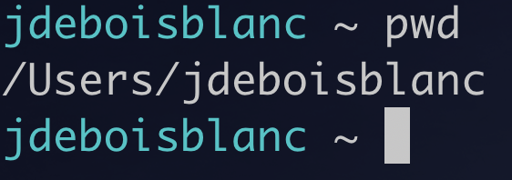
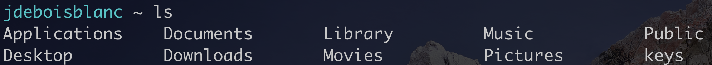
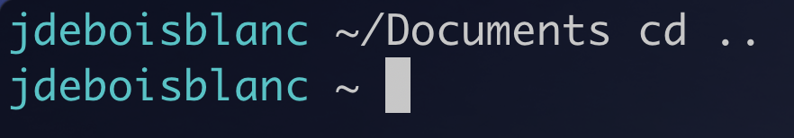
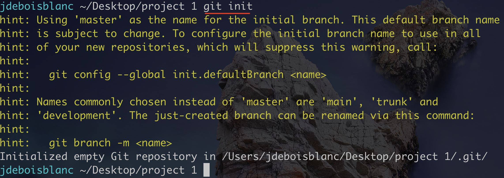
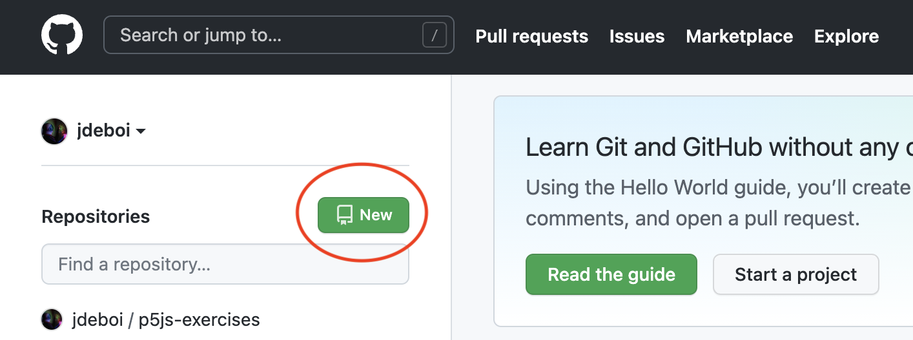
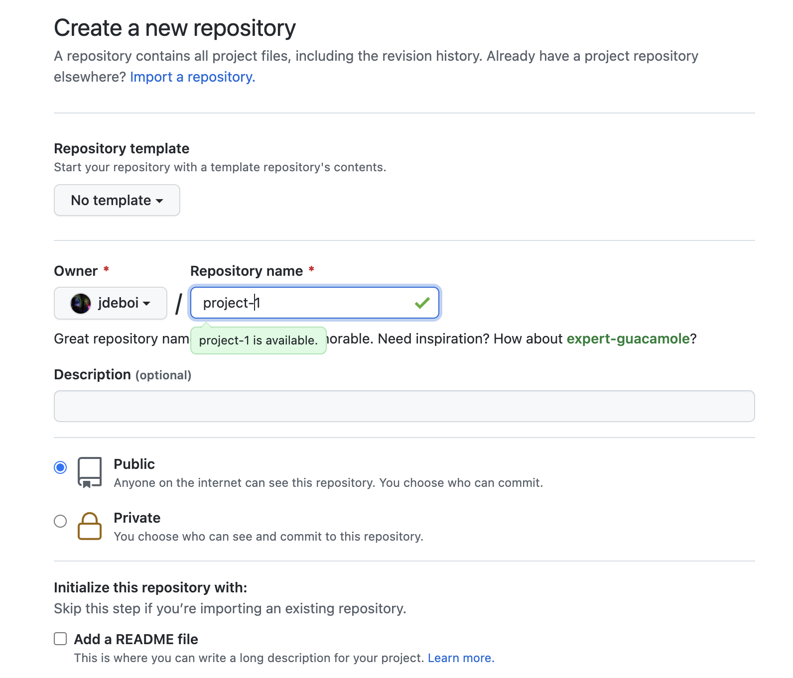
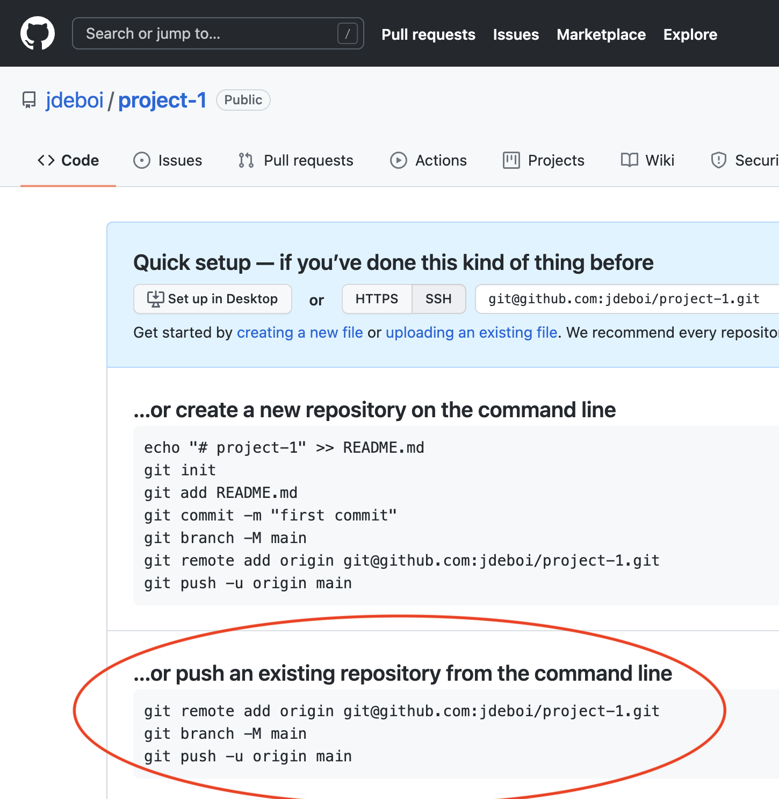
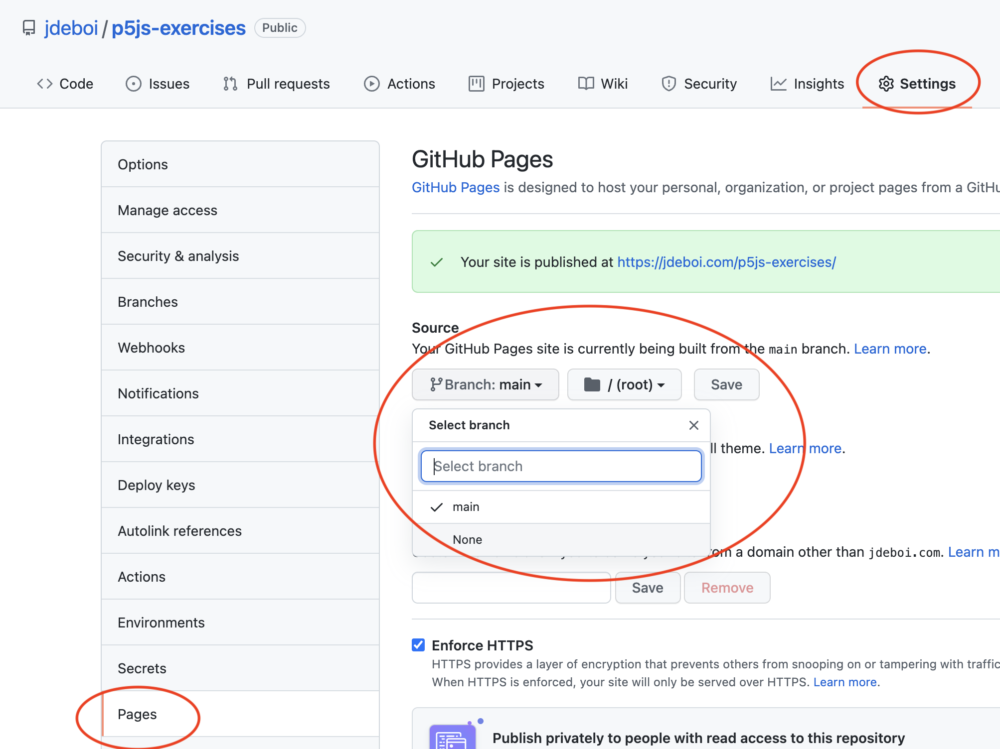

# 8. Git / GitHub

- [What is Git / GitHub](#what-is-git--github)
  - [Installing Git](#installing-git)
- [Command Line](#command-line)


---
## What is Git / GitHub?

- **Git** is a "version control system" meaning that it keeps snapshots (or "commits") of your code throughout the development process in order to go back in time if necessary. Think of Git as the "track changes" functionality of Google Docs applied to coding.

- **[GitHub](https://github.com/)** is a website on which you can publish your code ("Git repositories") and collaborate with other people. Think of GitHub as glorified Google Drive for programmers.

We will use Git to track code changes _locally_ and GitHub to submit code or collaborate _online_. 

### Installing Git
- Windows: Google and install Git for Windows
- [Mac instructions](https://docs.google.com/document/d/1IBXKul-zRLoXd0oKSW-oWcQ7NXBhb4BvgKidZhFVnfk/edit?usp=sharing)

If everything worked properly, open/ restart Terminal (Mac) or Git Bash (newly installed on Windows) and type `git`. You should see the following:


## Command Line
There are a few important commands to know. Open up Git Bash or Terminal (Mac). 

* `pwd` ("print working directory") prints what folder you're currently in
* `ls` lists all of the contents of that directory
* `cd [folder name]` ("change directory") open a directory, type "cd " and the name of the folder or path to the directory you'd like to open
* `cd ..` go back a directory





 
- **NOTE**: "~/" refers to the home directory, in my case, "/Users/jdeboisblanc", which we can see when we subsequently type pwd.
- **NOTE**: Trying pressing the **tab** key while typing a directory name for auto-completion. 
  - This is necessary for folders with a space.
 
```console
cd ~/Documents/Creative\ Coding
pwd
```

## Creating a Repo
We are going to create a Git repo (a folder where we track changes and push this repo to the internet (on GitHub). Here are the steps:

### Initialize a repo on your computer:
1. Inside of your terminal (Git Bash on Windows), use the commands you learned in the last section to change into the directory where your project exists.


2. To initialize a Git "repo", type:

```console
git init
```



1. Then we're going to add all of the files in our project folder to be tracked (nothing should happen):

```console
git add .
```

4. Now we're going to take a snapshot of our changes with a message "first commit!"

```
git commit -m "first commit!"
```


### Create the repo on GitHub
1.  Time to go online to Github. Find somewhere to create a new repository.
2. Give your repo a name (e.g. "First Project") and leave all of the other default values.





### Personal Access Token
Beginning in 2021, GitHub increased its security features. In order to push our code from the command line, we need to setup a personal access token.

1. Turn on 2 factor authentication.
   * Profile icon > Settings > Account Security > Two-factor authentication
2. Create Personal Access Token
   * Profile icon > Settings > Developer Settings > Personal access tokens > Generate new token
   * Copy this long string and save it somewhere locally on your machine where you will find it.

[Here is a video in case that's easier to watch](https://youtu.be/HJEzZbUclrg?t=324)


### Push your local changes to Github
1. Copy the code under "push existing repo" (see image below) and paste that into Git Bash / Mac Terminal. Hit enter.
2. It should ask you for your **username**. Type your GitHub account.
3. For your **password**, paste your **Personal Access Token**. 
4. If everything worked as planned, if you refresh the page on GitHub, you should see your project on GitHub.

https://youtu.be/HJEzZbUclrg?t=324

 

### Hosting your repo
If you want to be able to see your code running live on the web, we have to setup GitHub Pages.

1. From the GitHub repo's home page (online), click "Settings".
2. On the tab on the left, click pages.
3. Under "source", select "main" and hit save.



## Updating Changes
Let's say you've made changes to your code and you want those changes to be reflected online.

1. Open your terminal / Git Bash (Windows) and 
2. **Change into the directory** where your project is saved.
3. Type the following 3 commands into your console:

```console
git add .
git commit -m "some message about what you changed"
git push origin main
```

4. Go online (GitHub) and see if your site has changed. 
* You may have to have your **developer window open** so that the browser doesn't cache an old version
* It will likely take a few minutes for the servers to update the changes.

## Collaborating through Git

**Under Construction**

Let's assume two people are collaborating on a project (repo). 

PARTNER 1
1. Create the repo following the steps above
2. Add a collaborator

PARTNER 2
1. Accept the collaborator invitation (you’ll probably get an email)
2. Clone it down to your machine
3. Create a new branch
4. Open up the repo in your text editor and add the project
5. Add, commit and push that code to your branch GitHub
6. Create a pull request to merge your branch into main
7. Add your partner as a reviewer

PARTNER 1
... to be completed