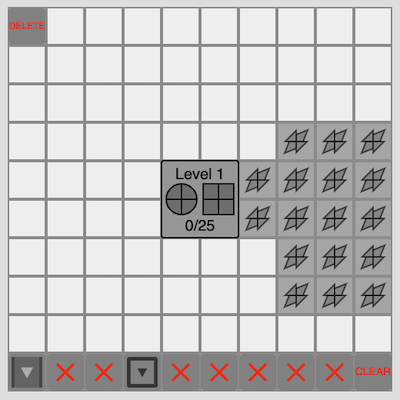

# Project 1

### Overview
In  this project students will demonstrate proficiency with JavaScript fundamentals and the p5.js library by developing interactive, single-page programs for the web. Students can draw inspiration from:

* [openProcessing](https://openprocessing.org/)
* The bizarre (and usually funny) site, [theuselessweb.com](theuselessweb.com)
* Video games (Galaga, ioGames, platformers, ...)

### Requirements
Your code must be published to the web using GitHub Pages. Additionally, at least one instance of the following components must be used (not just declared) in your code:
* Interactivity (keyboard, mouse, etc.)
* conditional logic (if/else)
* loop (for, while, etc.)
* array
* uniquely defined function that takes one or more arguments (cannot be satisfied by the object constructor)
* uniquely defined function that returns a value
* object + object constructor
* inheritance
* polymorphism

Note: you should begin by thinking about projects that lend themselves nicely to inheritance (e.g. games with different types of enemies, artistic brushes that have individualized drawing patterns, etc.)

## Evaluation
Projects will be evaluated on a 12 point scale based upon the following criteria:

1. **Meets Requirements**: Does the project follow directions and fulfill all aspects of the assignment? Are materials turned in on time?
2. **Correctness**: To what extent is your code free of bugs?
3. **Design and Style**: To what extent is your code written well (i.e., clearly, efficiently, elegantly, and/or logically)? To what extent is your code readable (i.e., commented and indented with variables aptly named)? Review [code style](../../codestyle.md)
4. **Creativity**: To what extent is the project unique, inventive, and imaginative?
5. **Complexity**: To what extent does the code demonstrate a mastery of the topic and in-depth understanding of the material?

