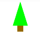
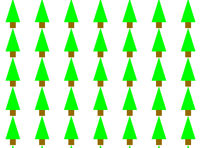
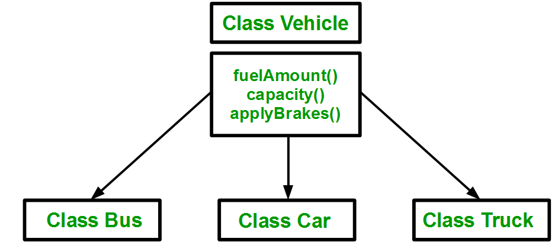
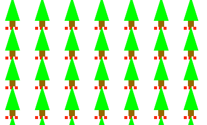
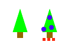

# 8. Object Oriented Programming

  - [Classes (a.k.a Object Constructor)](#classes-aka-object-constructor)
    - [Arrays of Objects](#arrays-of-objects)
      - [for of loop](#for-of-loop)
      - [forEach loop](#foreach-loop)
  - [Inheritance](#inheritance)
  - [Polymorphism](#polymorphism)

---

## Classes (a.k.a Object Constructor)
Object Oriented Programming (OOP) is a software development paradigm that is used across languages. It is used to group (or **encapsulate**) values and data inside of a **class**. 

In JavaScript, there are multiple ways to explore OOP. We will examine classes. To create a class, create a separate `.js` file with the class name and load the file into the `index.html` (above the `sketch.js` file).

```html
<!-- index.html -->
<script src="Tree.js"></script>
<script src="sketch.js"></script>
```

Here is the Tree class. Notice the **constructor**, which initializes the class. Also make note of the **this** keyword in the constructor and the method `display()`.

```javascript
// Tree.js
class Tree {
  
  constructor() {
    this.x = random(width);
    this.y = random(height);
    this.w = 25;
    this.h = 40;
    this.trunkW = 10;
    this.trunkH = 10;
  }

  display() {
    noStroke();
 
    // trunk
    fill(163, 109, 22);
    rect(this.x-this.trunkW/2, this.y+this.h, this.trunkW, this.trunkH);
    
    // leaves
    fill(0, 255, 0);
    triangle(this.x-this.w/2, this.y+this.h, this.x, this.y, this.x+this.w/2, this.y+this.h);
  }

}
```

In the `sketch.js` file we can use the Tree class like this:

```javascript
let tree;

function setup() {
    createCanvas(600, 400);
    // create a new tree object
    tree = new Tree();
}

function draw() {
    background(255);
    // display the tree object
    tree.display();
}
```

If we want to, we can pass arguments to the tree constructor:

```javascript
// Tree.js
constructor(x, y) {
    this.x = x;
    this.y = y;
    // other properties
}
```

And initialize the Tree object with x and y values:
```javascript
// sketch.js
tree = new Tree(100, 100);
```


### Arrays of Objects
Maybe we would like to create many trees. We can leverage arrays and loops to keep track of many objects at once. Let's make a forest!

```javascript
let trees = [];

function setup() {
    createCanvas(600, 400);

    for (let x = 0; x < 10; x++)
      for (let y = 0; y < 10; y++)
        trees.push(new Tree(x*50, y*50));
}

function draw() {
    background(255);

    for (let i = 0; i < trees.length; i++) {
      trees[i].display();
    }
}
```


#### for of loop
There are a few other types of loops that we can leverage with arrays that may make syntax a little easier. Here is an example using a **for of** loop:

```javascript
for (const tree of trees) {
    tree.display();
}
```

#### forEach loop
Here is an example of displaying trees using the **forEach** loop. The `=>` is what we call an **arrow function** in JavaScript. This is shorthand notation for calling a function. We won't worry too much about arrow functions for now, but if you're curious, [check out this reference](https://developer.mozilla.org/en-US/docs/Web/JavaScript/Reference/Functions/Arrow_functions).

```javascript
trees.forEach(tree => tree.display());
```

## Inheritance
**Inheritance** is another part of Object Oriented Programming that allows programmers to create relationships between classes and reuse code. In particular, "child" classes will *inherit* features and data from "parent" classes.

Here's an example of the type of relationships that might exist between a parent vehicle class and types of child objects:



Let's return to the tree example and examine a Christmas Tree, a child of Tree. Notice a few things:
* `extends` in the class declaration informs the program this is a child of Tree
* `super()` calls the parent constructor (must be first line in constructor)
*  We can still access `this.x` and other variables even though we didn't declare them in the Christmas Tree class. We have inherited these values from Tree.


```javascript
// ChristmasTree.js
class ChristmasTree extends Tree {
  
  constructor(x, y) {
    super(x, y);
    this.numPresents = 3;
  }

  displayPresents() {;
      for (let i = 0; i < this.numPresents; i++) {
          fill(255, i*10, 0);
          rect(this.x + (i-this.numPresents/2)*8, this.y+this.h+this.trunkH, 5, 5);
      }
  }
}
```

Let's make sure to add the `ChristmasTree.js` file to our `index.html`:

```html
<script src="Tree.js"></script>
<script src="ChristmasTree.js"></script>
<script src="sketch.js"></script>
```

Instead of creating Tree objects we create ChristmasTree objects: 
```javascript
for (let x = 0; x < 10; x++)
    for (let y = 0; y < 10; y++)
        trees.push(new ChristmasTree(x*50, y*50));
```

And we make sure to call the `displayPresents()` method:

```javascript
for (const tree of trees) {
    tree.display();
    tree.displayPresents();
}
```



## Polymorphism
**Polymorphism** is another tenet of OOP. Polymorphism is the process by which objects override shared methods (functions) with their own more specific implementations of functions. 

For example, let's say that we want Christmas Trees to always be displayed with ornaments when the `display()` function is called, but we don't want normal trees to be displayed with ornaments.


```javascript
// ChristmasTree.js
class ChristmasTree extends Tree {
  
  constructor(x, y) {
    super(x, y);
    this.numPresents = 3;
  }

  display() {
    super.display();
    this.displayOrnaments();
    this.displayPresents();
  }

  displayOrnaments() {
      fill(0, 0, 255);
      ellipse(this.x - 10, this.y - 20, 8);
      ellipse(this.x + 3, this.y - 10, 8);
      ellipse(this.x, this.y - 5, 8);
  }

  displayPresents() {;
      for (let i = 0; i < this.numPresents; i++) {
          fill(255, i*10, 0);
          rect(this.x + (i-this.numPresents/2)*8, this.y+this.h+this.trunkH, 5, 5);
      }
  }
}
```


Notice a variety of things going on:
* we call `super.display()` inside the Christmas Tree display to use the parents method
* we have to use the `this` keyword to call methods inside the class (e.g `this.displayOrnaments()`)
* When we call `display()` for a normal tree, it looks unadorned. When we call the same method on a Christmas Tree, however, polymorphism ensures that the more specific version of `display()` gets called.

```javascript
// sketch.js
let normalTree;
let xmasTree;

function setup() {
    createCanvas(600, 400);

    normalTree = new Tree(100, 100);
    xmasTree = new ChristmasTree(150, 100);
}

function draw() {
    background(255);

    normalTree.display();
    xmasTree.display();
}
```



Consider a more nuanced example. Certain properties and methods are left out for clarity.

```javascript
// Tree.js
class Tree {
  
  constructor() {
    // other properties not included for clarity
    this.h = 50;
    this.age = 0;
  }

  getOlder() {
    this.age++;
    this.grow();
  }

  grow() {
    this.h++;
  }
}
```

```javascript
// ChristmasTree.js
class ChristmasTree extends Tree {
  
  constructor() {
  }

  grow() {
    this.h += 10;
  }
}
```

When we create a ChristmasTree in the sketch, let's see how fast the tree grows:


```javascript
// sketch.js
let normalTree;
let xmasTree;

function setup() {
    createCanvas(600, 400);

    normalTree = new Tree(100, 100);
    xmasTree = new ChristmasTree(150, 100);
}

function draw() {
    background(255);

    normalTree.display();
    xmasTree.display();

    normalTree.getOlder();
    xmasTree.getOlder();
}
```

Important note: there is no definition of `getOlder()` inside the ChristmasTree class. When the `xmasTree.getOlder()` method is called, it invokes the parent class method:

```javascript
// Tree.js 

getOlder() {
  this.age++;
  this.grow();
}
```

Despite calling `this.grow()` inside the parent Tree class, the `xmasTree` grows at a rate of 10 pixels (not 1). Since `this.grow()` is overridden in the child ChristmasTree class, the call to `this.grow()` in the parent class results in calling the `this.grow()` method of the child ChristmasTree class. In short, this is **polymorphism** at play.