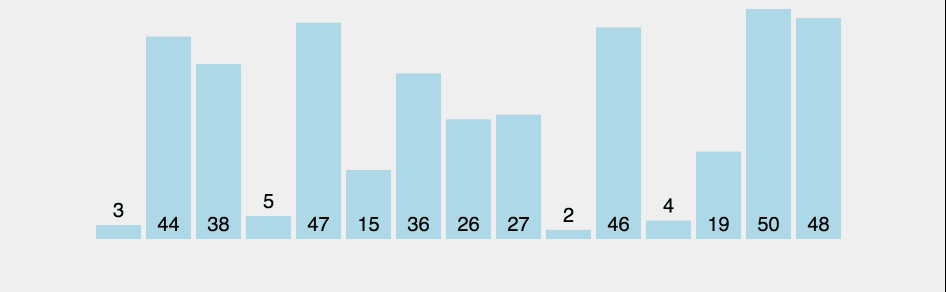

# Sort Algorithms

- [Sort Algorithms](#sort-algorithms)
  - [selection sort](#selection-sort)
  - [bubble sort](#bubble-sort)
  - [merge sort](#merge-sort)
  - [Big O \& Big-Ω](#big-o--big-ω)
    - [Key takeaways:](#key-takeaways)
    - [Time Complexity Visualization:](#time-complexity-visualization)
  
---
## selection sort

**Pseudocode**: 

* repeat until no unsorted elements remain: 
  * search the unsorted part of the data to find the smallest value
  * swap the smallest found value with the first element of the unsorted part

## bubble sort
**Pseudocode**: 

* Set swap counter to a non-zero number
* Repeat until counter is 0
  * Reset swap counter to 0
  * Look at each adjacent pair
    * If two adjacent elements are not in order, swap them and add one to the swap counter

## merge sort

In merge sort, the idea of the algorithm is to sort smaller arrays and then combine those arrays together (merge them) in sorted order. Merge sort leverages **recursion**.

**Pseudocode**: 
If n > l
   1. Find the middle point to divide the array into two halves
   2. Call merge sort for first half
   3. Call merge sort for second half
   4. Merge the two halves sorted in step 2 and 3

[link to gifs](http://www-scf.usc.edu/~zhan468/public/Notes/sorting.html)

## Big O & Big-Ω 
**Big-Ω** (Big-Omega) refers to the **best-case** time of an algorithmm. We will consider both Big-O and Big-Ω of these 3 sorting algorithms.

| Algorithm  | Big-O  | Big-Ω  | 
|---|---|---|
| Selection Sort  | O(n2)  | Ω(n2)  | 
| Bubble Sort  | O(n2)  | Ω(n)  |  
| Merge Sort  | O(n log n)  | Ω(n log n)  |   

### Key takeaways:
1. **Worst case selection sort and bubble sort are O(n2)**. 
     * Worst case, both algorithms will have to scan the array one time for *every* element in the array to ensure move the element to the correct location (e.g. scan N times for N elements), or O(n2).
2. **For the worst case** scenario, **merge sort performs better** than selection sort and bubble sort: **O(n log n)**.
     * For a wishy-washy explanation, see [Harvard CS50](https://youtu.be/jUyQqLvg8Qw?t=4284).
     * Wondering why fibonnaci is 2n but binary / merge sort is log n? [Checkout this stackoverflow](https://stackoverflow.com/questions/34698842/why-is-the-fibonacci-sequence-big-o2n-instead-of-ologn). 
3. **When the array is already sorted, bubble sort is more efficient— O(n) —** than either selection or merge sort. Examine the animation and the code to explain why.  

### Time Complexity Visualization:

