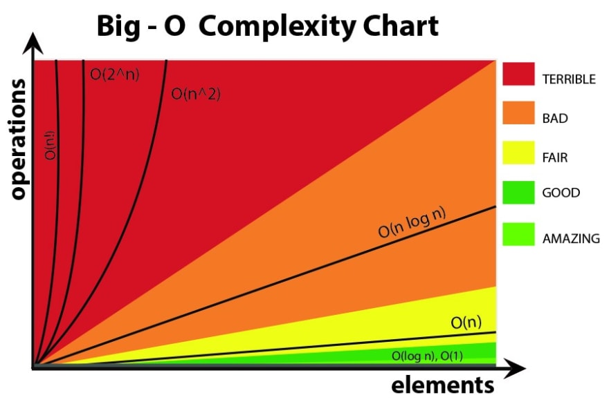

# Big 0

[Watch this video for an overview of Big-O Notation](https://www.youtube.com/watch?v=__vX2sjlpXU)

* a way to analyze the efficiency of an algorithms
  * space (amount of memory)
  * time (how long to execute code)

We use Big O to describe an algorithm's **complexity**, or the amount of resources (time and memory) it takes to run.


* it represents worst-case running time
* constants don't matter
* only take highest order term

Constant `O(1)`
```javascript
function getConstant(n) {
  return n*100 + 20;
}
```

Constant `O(n)`
```javascript
function getLinear(n) {
  let x = 0;
  for (let i = 0; i < n; i++) {
    x += n;
  }
  return x;
}
```

Quadratic `O(n<sup></sup>)`
```javascript
function getQuadratic(n) {
  let x = 0;
  for (let i = 0; i < n; i++) {
     for (let j = 0; j < n; j++) {
        x += n;
      }
  }
  return x;
}
```

Combination

```javascript
function getCombo(n) {
  return getLinear(n) + getQuadratic(n);
}
```




assignments
= analyze algorithms
= determine which ones are which
