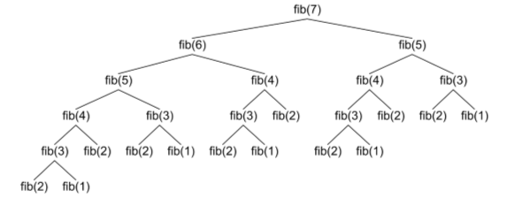

# Recursion

[slide notes](https://docs.google.com/presentation/d/1Sq7Muc1y4QVwxczjBsBK0jeLWepXWAMoCoL91y1SouM/edit?usp=sharing)

A **recursive** function is a function that calls itself. Every recursive function has two parts:

1. a base case or termination condition
2. a non-base case that calls the function and moves it towards termination


```javascript
function recursiveFun(...) {
    if (/* base case */) {
        // stop calling
    }
    else {
        recursiveFun(...)
    }
}
```

**NOTE**: If your code never reaches the base case, you will end up with infinite recursion, causing your program to run out of memory!

## Writing Recursive Functions
Write a function that calculates the factorial of a number.

| Iteratively | Recursively |
| ----------- | ----------- |
| 0! = 1      | 0! = 1       |
| 1! = 1      | 1! = 1 \* 0!     |
| 2! = 2\*1    | 2! = 2 \* 1!     |
| 3! = 3\*2\*1  | 3! = 3 \* 2!        |
| n! = n\*..3\*2\*1  | n! = n \* (n-1)!       |


Here is the recursive function in action:

```javascript
function factorial(n) {
    if (n === 0)
        return 1;
    else
        return n * factorial(n-1);
}
```

Compare this to the iterative solution:

```javascript
function factorial(n) {
    let fac = 1;
    for (let i = 1; i <= n; i++) {
        fac *= n;
    }
    return fac;
}
```

## When to use recursion?
Any time you can write a recursive function you can also write an iterative (using a loop) solution. Additionally, there are times when using recursion has **very significant impacts on time complexity**. 

Consider, for example, the iterative and recursive solutions for calcuating the fibonacci sequence:

```javascript
// iterative
function fibIterative(num) {
   let before = 0;
   let current = 1;
   let sum = 1;
   for (let i = 0; i < num; i++) {
       sum = before + current;
       before = current;
       current = sum;
   }
   return sum;
}

// recursive
function fibRecursive(num) {
  if (num == 0)
    return 1;
  if (num == 1)
    return 1;
  return fibRecursive(num-1) + fibRecursive(num-2);
}
```
Incredibly, the iterative function is O(n) where as the recursive solution is asymptotically O(2<sup>n</sup>). `fibRecursive(100)` will crash your browser, whereas `fibIterative(100)` will run almost instantaneously. Look at the tree of recursive function calls to understand why:



### When to avoid recursion:
1. algorithms with large arrays (too many recursive calls can lead to memory overloads)
### When to use recursion:
1. number of operations is small and recursion simplifies readability of code 
2. branching processes with trees
3. divide-and-conquer algorithms (mergesort and binary search)

