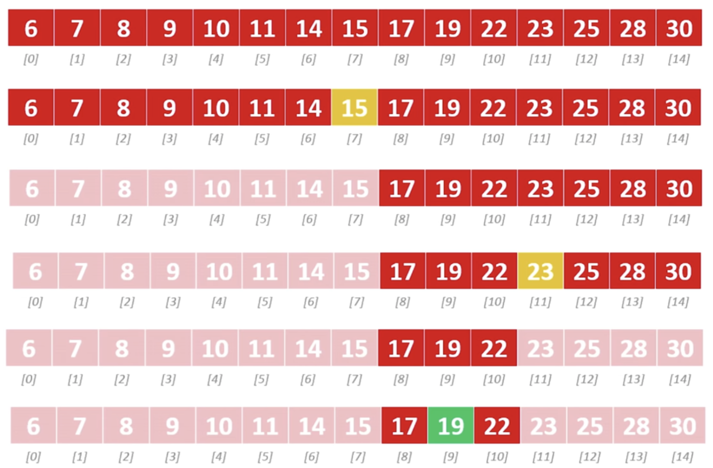

# Search Algorithms

## linear search
Let's say we have an array of unknown elements containing the numbers 1-100 and we're trying to find a element equal to 4. Since the values are unknown, we have to scan the array one element at a time to find the value we're looking for.

```javascript
let arr = [22, 42, 2, 99, 58, 16, ... , 4, 30, ...];

function linearSearch(arr, num) {
  for (let i = 0; i < arr.length; i++) {
    if (arr[i] === num) {
      return i;
    }
  }
  return -1;
}
```

In the **best case**, 4 will be the first item in the array, meaning this algorithm runs in constant time. **Worst case**, 4 will be the last item, meaning `linearySearch()` has a time complexity of `O(n)`.

## binary search
Binary search is a more efficient search algorithm; however, it requires that the **data is already sorted**. The idea is to divide-and-conquer, reducing the search area by half each time in order to find the target.

**Pseudocode**:  
* Repeat until subarray is size 0
  * Calculate the middle point of the (sub)array
  * If you find the target, stop
  * Otherwise, 
    * If the target is less that the middle, repeat the algorithm but search the subarray to the left.
    * If the target is greater than the middle, repeat the algorithm but search the subarray to the right.

Here is a visualization of the algorith when searching for the number 19.



### O(log n)

Binary search has a worst case time complexity of `O(log n)`. Each time the algorithm runs, it cuts the number of searchable elements in half. The logarithm in base 2 of N tells us the number of times (or steps) required to search all elements.

