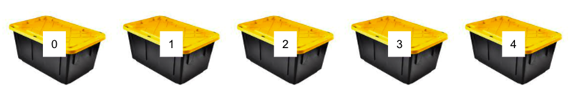
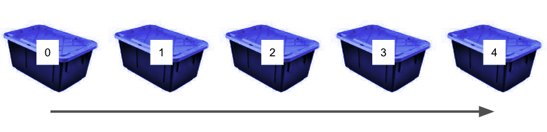
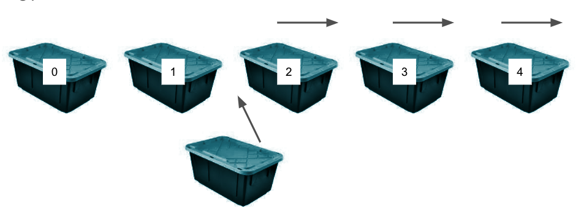
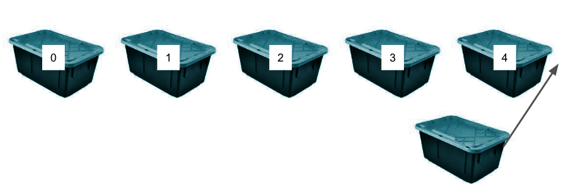
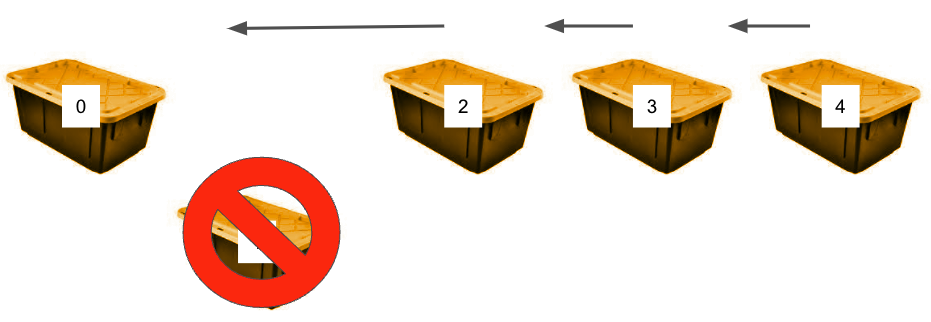

# Arrays

  - [Access](#access)
  - [Search](#search)
  - [Insert](#insert)
  - [Delete](#delete)
  - [Summary](#summary)

---

When we're writing code, we need to store data in memory. As we've seen, there are costs (in time and space/ memory) associated with how we store, search, and sort that data. So far we're seen arrays and objects, but there are myriad other **data structures** that facilitate the storage and manipulation of data sets. Different data structures have different properties and different use cases, which we will examine in this unit.  

**Arrays** are the first data structure we will dig into. Technically *arrays in JavaScript are actually hash tables* (which we will see next). For the purposes of this thought exercise (and this course), when we discuss arrays, we will consider arrays that are **contiguous memory** blocks (the case for C++). If you want to know more about arrays in JavaScript, check out [this Stack Overflow response](https://stackoverflow.com/questions/20321047/how-are-javascript-arrays-represented-in-physical-memory).

## Access
Since we're considering arrays as a contiguous set of "bins," imagine the scenario where your camping stuff is in bin 3. How long does it take to find your stuff (in Big O notation)?

## Search
If you don’t remember what box your camping stuff is in, what is Big O?

## Insert
We need to put our winter clothes in a new box and it makes sense to make it #2. Unfortunately, that means we need to move all of our other boxes over. What’s Big O?

Putting a box at the end is different, however, What is Big O in this case?

## Delete
Time to give our old clothes to Good Will. What’s Big O?

## Summary

| Access | Search | Insert | Insert  @ end | Delete |
|:------:|:------:|:------:|:-------------:|:------:|
|  O(1)  |  O(n)  |  O(n)  |      O(1)     |  O(n)  |