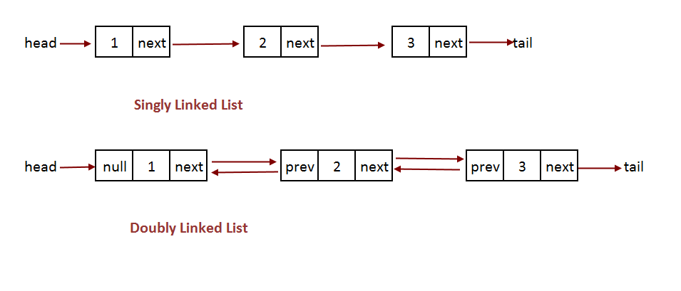

# Linked Lists

  - [Overview](#overview)
    - [Types](#types)
    - [Use Cases](#use-cases)
  - [Classes](#classes)
  - [Big O](#big-o)

---

## Overview
A linked list is a linear collection of elements or nodes. Nodes are not contiguous in memory (as we discussed in arrays), but rather each node points to the next node.

### Types



### Use Cases
* Useful for applications that need to perform many inserts (prevents expensive operations of shifting array elements).
  * implementing stacks (first in, first out)
  * implmenting queues (first in, last out)


## Classes

```javascript
class SingleNode {
    constructor(value) {
        this.value = value;
        this.next = null;   // node
    }
}

class SinglyLinkedList {
    constructor() {
        this.head = null;   // node
    }

    // example method
    // get last node in SLL
    getLast() {
        let lastNode = this.head;
        if (lastNode) {
            while (lastNode.next) {
                lastNode = lastNode.next
            }
        }
        return lastNode
    }
}
```

There are two main differences in the implementation of a doubly-linked list: the inclusion of a "prev" node and a tail in the DLL class:

```javascript
class DoubleNode {
    constructor(value) {
        this.value = value;
        this.next = null;   // node
        this.prev = null;   // node
    }
}

class DoublyLinkedList {
    constructor() {
        this.head = null;   // node
        this.tail = null;   // node
        this.length = 0;
    }

    // example method
    // insert node at end of the list
    append(value) {
        let newNode = new DoubleNode(value);

        this.tail.next = newNode;
        newNode.previous = this.tail;
        this.tail = newNode;

        this.length++;
    }
}
```

## Big O

|               | Access | Insert/Delete @ beginning | Insert/Delete @ end | Insert/Delete mid |
|---------------|:------:|:-------------------------:|:-------------------:|:-----------------:|
|     Array     |  O(1)  |            O(n)           |         O(1)        |        O(n)       |
| Singly Linked |  O(n)  |            O(1)           |         O(n)        |        O(n)       |
| Doubly Linked |  O(n)  |            O(1)           |         O(1)        |        O(n)       |