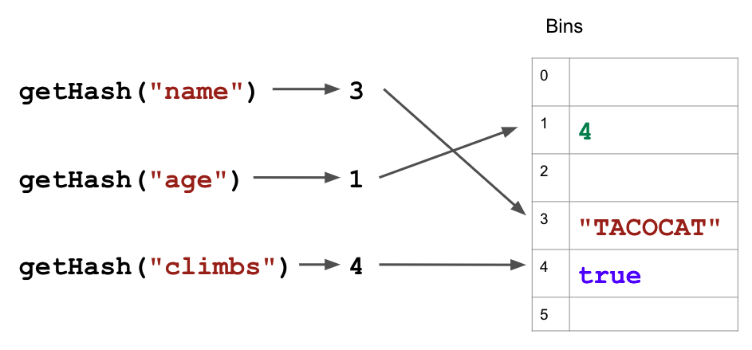

# Hash Map

  - [Hash Functions](#hash-functions)
  - [Collisions...](#collisions)
  - [JavaScript Map class](#javascript-map-class)
  - [Big O](#big-o)

---
**HashMaps** are like arrays but use index labels (**keys**) for very fast retrieval of information (**values**). Consider JavaScript objects, which essentially have the same functionality as hash maps:

```javascript
let pet = {
    name: "TACOCAT",
    age: 4,
    climbs: true
}

console.log(pet.climbs);  // accessing value using a key
```

## Hash Functions
To understand the how this data structure is implemented internally, we need to understand hash functions. **Hash functions** map an input of arbitrary size (the key) to a fixed-size value. Think of a hash function as a binning function. 
The hash function takes a key (e.g. a string) and returns a corresponding bin (i.e. memory slot). Consider the following (bad) hash function:

```javascript
/* converts a string key into a number */
function getHash(key) {
    const numBins = 6;
    let hashValue = 0;
    for (let index = 0; index < key.length; index++) {
        const charCode = key.charCodeAt(index);
        hashValue += charCode;
    }
    return hashValue % numBins;
}
```

Calling this function with the keys of our `pet` object returns the following values:
```javascript
console.log(getHash("name"));   // 3
console.log(getHash("age"));    // 1
console.log(getHash("age"));    // 4
```

If we implement a hashmap with an array (in this case of length 6), here is how we might use our hash function and keys to store (and retrieve) data:



## Collisions...
The story of hashmaps gets more complicated when we consider the possibility of **collisions**— when two different keys produce the same hash code. In our example above, "bites" and "age" produce the same bin number.

```javascript
let pet = {
    name: "TACOCAT",
    age: 4,
    climbs: true,
    bites: true
}
console.log(getHash("age"));        // 1
console.log(getHash("bites"));      // 1
```
This potentially creates serious issues for storing and retrieving information since two labels point to the same bin. We can resolve this issue by storing collisions in a linked list (a data structure we'll see in the next section). See how key values are stored in the image below ([source](https://adrianmejia.com/data-structures-time-complexity-for-beginners-arrays-hashmaps-linked-lists-stacks-queues-tutorial/):
)


## JavaScript Map class

So far we have talked about JavaScript objects as HashMaps. JavaScript has a class called **Map** that also stores data in **key-value** pairs. The difference with this class is that Maps can use any data (i.e. object) as a key, where as JavaScript objects can only use strings as keys.

Here is an example of the Map class, [taken from this reference page](https://developer.mozilla.org/en-US/docs/Web/JavaScript/Reference/Global_Objects/Map):

```javascript
const map1 = new Map();

// set:
map1.set('a', 1);
map1.set('b', 2);

// get:
console.log(map1.get('a'));     // 1

// delete:
map1.delete('b');
console.log(map1.size);         // 2

// difference from JavaScript Object:
const person = {'name': 'deBB'};
map1.set(person, 32);
console.log(map1.get(person));      // 32
```

## Big O

For the purposes of this class, we can assume our HashMap array is sufficiently large and our hash function is sufficiently good at creating unique hash codes so that we won't worry about collisions when calculating Big O. 

* **Access**: Computing the hash is O(1) and we hop right to the place in memory.
* **Search**: We know exactly where to look… O(1)
* **Insert**: Doesn’t maintain any specific order, so constant time… O(1)
* **Delete**: Same logic as before… O(1)

|         | Access | Search | Insert | Delete |
|---------|:------:|:------:|:------:|:------:|
| HashMap |  O(1)  |  O(1)  |  O(1)  |  O(1)  |
|  Array  |  O(1)  |  O(n)  |  O(n)  |  O(n)  |


---

**CAVEATS**: 
1. **This is an overly simplified** description of HashMaps, hash functions, & Big O designed to focus on big ideas. 
2. I began by defining arrays as contiguous blocks of memory (the case for many languages). In JavaScript, however, arrays are actually implemented as hash maps with integer keys... [see this Stack Overflow response if you're curions](https://stackoverflow.com/questions/20321047/how-are-javascript-arrays-represented-in-physical-memory). 

For a more resilient / in-depth method of implementing hash maps, [check out adrianmejia.com](https://adrianmejia.com/data-structures-time-complexity-for-beginners-arrays-hashmaps-linked-lists-stacks-queues-tutorial/). 
