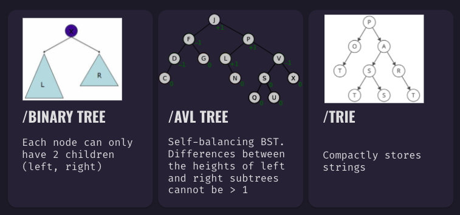

# Trees

  - [Overview](#overview)
    - [Types](#types)
    - [Use Cases](#use-cases)
  - [BST Classes](#bst-classes)
  - [BST Complexity](#bst-complexity)

---
## Overview
Trees are a **non-linear** data structure that exist in a variety of different types.


### Types

(Adapted from Kelsey Sha and Alekha Rao's presentation).



### Use Cases
* fast insert, search and delete operations
* search applications
* autocomplete 

## BST Classes
For the purposes of this class, we are going to focus on **binary search trees**. The Node class keeps track of the value as well as the left and right children (initially null).  

```javascript
class Node {
    constructor(value) {
        this.value = value;
        this.left = null;   // node
        this.right = null;  // node
    }
}
```

The Binary Search Tree class stores the root node. The implementation of an insert function is included below:

```javascript
class BSTree {
    constructor() {
        this.root = null; // node
    }

    insertNode(node, newNode){
        // first check for duplicates
        if (newNode.data === node.data) {
            return;
        }
        
        // if data is greater, add to right
        if (newNode.data > node.data) {
            if (node.right == null) {
                node.right = newNode;
            }
            else {
                this.insertNode(node.right, newNode);
            }
        }

        // if data is less, add to left
        else {
            if (node.left == null) {
                node.left = newNode;
            }
            else {
                this.insertNode(node.left, newNode);
            }
        }
    }

    /* other methods */
}
```


## BST Complexity
If a BST is not balanced, many of the operations will have to search every node (like an array).


|         | Average | Worst | 
|---------|:------:|:------:|
| Space |  O(n)  |  O(n)  | 
|  Insert  |  O(log n)  |  O(n)  | 
|  Search  |  O(log n)  |  O(n)  | 
|  Delete  |  O(log n)  |  O(n)  | 

