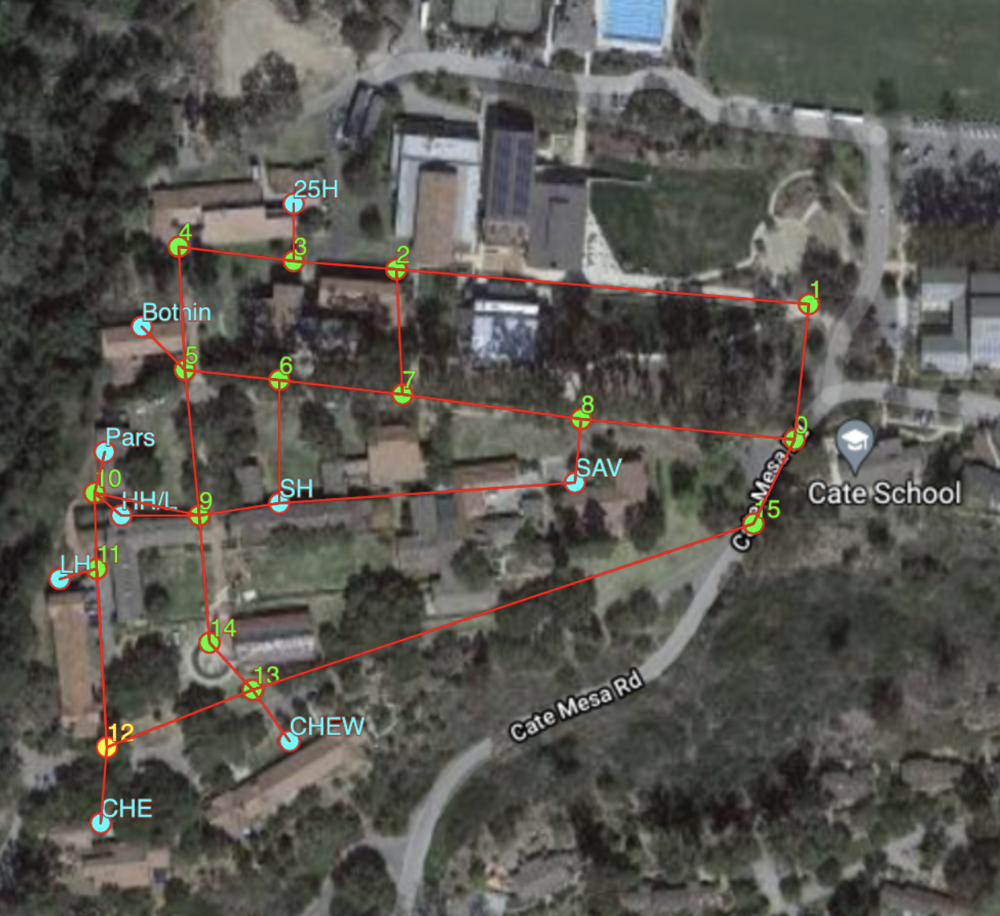

# Data Structure Labs

Students work in groups of 2 and choose from one of the following:

### Location App (Graph)

Students will use a graph data structure representing the map of Cate in order to develop an app that gives walking directions (including times and distances) between dorms.

2. paint app with undo/redo button (stacks)

### Image Compression (Quad Trees)
Students will use a quad tree data structure to develop 