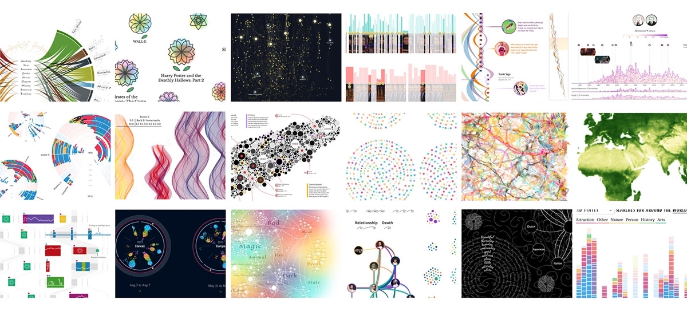

# Final Project

  - [I. Overview](#i-overview)
    - [1. Google Colab Notebook](#1-google-colab-notebook)
    - [2. Visual Data Essay](#2-visual-data-essay)
  - [II. Suggested Timeline](#ii-suggested-timeline)
  - [III. Resources](#iii-resources)

---
## I. Overview 
Students will analyze and visualize a large data set based on a personally-relevant **theme** (e.g. public health, incarceration, climate change, or affordable housing). You might consider advocating for a particular policy (e.g. pushing the school to divest from fossil fuels), or spreading awareness about a social justice issue (e.g. the school to prison pipeline). **Begin by identifying your goal**, and start to accumulate data sets relevant to your topic.  

The project consists of two parts:

1. [Google CoLab Notebook](#1-google-colab-notebook) - a Python "lab notebook" that documents the process of collecting, cleaning, understanding, and analyzing your data. 
2. [Visual Data Essay](#2-visual-data-essay) - a HTML/JavaScript web-based report that tells a **coherent, unified story** based on your data analysis. This report mixes interactive visualizations with narrative text.

### 1. Google Colab Notebook
As you're first starting to make sense of your data, your initial ideas and analysis will comprise your Google Colab Notebook. Google Colab allows you to mix text and Python code snippets. 

Your Google Colab Notebook should loosely resemble a lab notebook that works through the **scientific method** in order to draw conclusions from your data. For example, you might have the following sections:

1. Guiding questions - questions you intend to explore about the data 
2. Initial Observations - simple plots, graphs, etc
3. Hypotheses - form some conjectures based on the observations
4. Quantitative analysis - e.g. mean, median, mode, aggregation, ...
5. Conclusions - what you learned about the data
6. Data output - a cleaned dataset ready to be exported / visualized
7. Citations
 
### 2. Visual Data Essay
Once you have analyzed your data, you need to present the information and conclusions in a compelling, engaging, and polished web-based report that combines narrative text and interactive data visualizations. The report should include:

* **3 visualizations taking different analytical approaches**  
  * *At least 1* must be creative & **innovative** (i.e. more novel than bar charts, scatter plots, pie charts, histograms, etc.) 
  * *At least 1* of your visualizations must include some form of **interaction**. 
  * You can use p5.js, d3.js, or other libraries (e.g. three.js!)
* **Written explanations, context, and analysis** to support the visual narrative and make a persuasive argument about your topic (>= 300 words).

Each visualization should: 

* Have its own Javascript file but be embedded within the HTML report
* Include documentation
  * Whenever relevant, include axis labels, units, titles, and legends.
  * Include a link to the data source in a comment in the code, as well as a citation of the source (for example, a label at the bottom of the chart)

## II. Suggested Timeline

| **Week** | **Date** |       **Topic**      |
|:--------:|----------|:--------------------:|
|   23-25  |    ...   | Introduction to Unit |
|    26    |   4/11   | CoLab Report         |
|    27    |   4/18   | CoLab Report         |
|    28    |   4/25   | Data Viz 1           |
|    29    |    5/2   | Data Viz 2           |
|    30    |    5/9   | Data Viz 3           |
|    31    |   5/16   | Finalize Reports     |

## III. Resources
**Data sets**
* [Kaggle](https://www.kaggle.com/)
* [Google Dataset Search](https://datasetsearch.research.google.com/)
* [Data.gov](https://data.gov/)
* [NASA Earth data](https://earthdata.nasa.gov/)

**Useful sites** 

* [Flowing Data](https://flowingdata.com/)
* [Pudding](https://pudding.cool/)
* [NYT Graphics](https://www.nytimes.com/spotlight/graphics)
* [Information is Beautiful](https://informationisbeautiful.net/)
* [Reddit r/dataisbeautiful](https://www.reddit.com/r/dataisbeautiful/)

**Visual Essay Examples**

* [Chicago's Million Dollar Blocks](https://chicagosmilliondollarblocks.com/#12/41.9093/-87.6872)
* [NYT Tulsa Massacre Visualization](https://www.nytimes.com/interactive/2021/05/24/us/tulsa-race-massacre.html)
* [Women in Headlines](https://pudding.cool/2022/02/women-in-headlines/)
* [The Marshall Project](https://www.themarshallproject.org/2020/12/18/1-in-5-prisoners-in-the-u-s-has-had-covid-19)